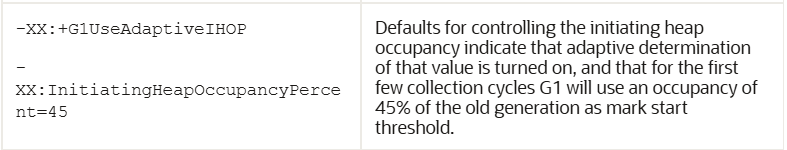
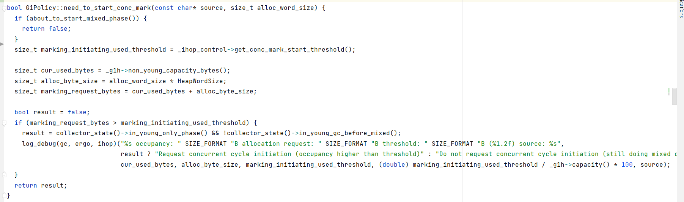

# issue3前期遇到的问题

## 1 InitiatingHeapOccupancyPercent参数

1. 官方解析



InitiatingHeapOccupancyPercent：已使用的内存达到 old generation 的InitiatingHeapOccupancyPercent值时，触发并发标记阶段。

2. 在Kona JDK 17的源码

2.1 在分配humongous对象的时候，就会检查是否开启并发标记阶段，在里面对IHOP参数进行预测和调整

```c++
// src/hotspot/share/gc/g1/g1CollectedHeap.cpp
HeapWord* G1CollectedHeap::attempt_allocation_humongous(size_t word_size) {
...
  // 在分配对象之前进行检测是否需要开启并发标记阶段，查看src/hotspot/share/gc/g1/g1Policy.cpp
  if (policy()->need_to_start_conc_mark("concurrent humongous allocation",
                                        word_size)) {
    collect(GCCause::_g1_humongous_allocation);
  }
...
}
```

2.2 然后是need_to_start_conc_mark函数，照片比较规整好看，这里用照片

```
// src/hotspot/share/gc/g1/g1Policy.cpp
```



```
size_t marking_initiating_used_threshold = _ihop_control->get_conc_mark_start_threshold();
这里获得的就是IHOP设置的阈值。
```

```c++
size_t cur_used_bytes = _g1h->non_young_capacity_bytes();
返回的是除新生代以外的内存使用情况，继续查看源码

// src/hotspot/share/gc/g1/g1CollectedHeap.hpp
size_t non_young_capacity_bytes() {
    return (old_regions_count() + _archive_set.length() + humongous_regions_count()) * HeapRegion::GrainBytes;
  }
```

```
size_t alloc_byte_size = alloc_word_size * HeapWordSize; // 这里是分配给新对象的内存
size_t marking_request_bytes = cur_used_bytes + alloc_byte_size; // 得到标记阶段需要的内存大小
```

由下面的判断我们知道：IHOP参数的涵义就是：已使用的内存占老区的比重的阈值，达到这个阈值就会触发并发标记阶段

```c++
if (marking_request_bytes > marking_initiating_used_threshold) {
```


3. 问题：

我在下面的测试中，依然发现IHOP设置的是：已使用的内存**整个堆**的比重的阈值，达到这个阈值就会触发并发标记阶段

## 2 测试

### 2.1 测试代码

```java
public class G1GCTest {
    public static void main(String[] args) {
        int _1M = 1024 * 1024;
        byte[] b1, b2, b3;
        b1 = new byte[_1M / 3];

        b2 = new byte[_1M * 2];

        b3 = new byte[_1M * 2];
        b3 = null;
        b3 = new byte[_1M * 2];
    }
}
```

### 2.2 测试参数

**第一次测试**：设置参数-XX:InitiatingHeapOccupancyPercent=60

```
-XX:+UseG1GC -XX:G1HeapRegionSize=1m -XX:MaxTenuringThreshold=5 -Xms10M -Xmx10M -XX:InitiatingHeapOccupancyPercent=60
```

日志：

```
[0.377s][debug][gc,ergo,ihop  ] Request concurrent cycle initiation (occupancy higher than threshold) occupancy: 5242880B allocation request: 2097168B threshold: 6291456B (60.00) source: concurrent humongous allocation
[0.377s][debug][gc,ergo       ] Request concurrent cycle initiation (requested by GC cause). GC cause: G1 Humongous Allocation
[0.377s][info ][gc,start      ] GC(0) Pause Young (Concurrent Start) (G1 Humongous Allocation)
...
[0.380s][info ][gc,heap       ] GC(0) Eden regions: 1->0(1)
[0.380s][info ][gc,heap       ] GC(0) Survivor regions: 0->1(1)
[0.380s][info ][gc,heap       ] GC(0) Old regions: 0->0
[0.380s][info ][gc,heap       ] GC(0) Archive regions: 2->2
[0.380s][info ][gc,heap       ] GC(0) Humongous regions: 3->3
```

可以看到，已使用的内存为 5242880B， 需要给新对象分配  2097168B（2M）大小的内存，则 5242880B + 2097168B > 6291456B（6M），这里的阈值居然还是 6 M（整个堆的60%），不应该是老区的 60%吗？由后面的日志可以看到，执行完GC(0)之后， Survivor regions 依然存在对象的，也就是对象b1，说明老区不可能会被分配到10M内存（即触发并发标记的阈值不可能为6M）。


**第二次测试**：不设置-XX:InitiatingHeapOccupancyPercent

日志：得到的结果依然如此，此时使用默认的IHOP(45%)

```
[0.472s][debug][gc,ergo,ihop  ] Request concurrent cycle initiation (occupancy higher than threshold) occupancy: 5242880B allocation request: 2097168B threshold: 4718592B (45.00) source: concurrent humongous allocation
[0.473s][debug][gc,ergo       ] Request concurrent cycle initiation (requested by GC cause). GC cause: G1 Humongous Allocation
...
[0.478s][info ][gc,heap       ] GC(0) Eden regions: 1->0(1)
[0.478s][info ][gc,heap       ] GC(0) Survivor regions: 0->1(1)
[0.478s][info ][gc,heap       ] GC(0) Old regions: 0->0
[0.478s][info ][gc,heap       ] GC(0) Archive regions: 2->2
[0.478s][info ][gc,heap       ] GC(0) Humongous regions: 3->3
```


**第三次测试**：使用参数 -XX:+G1UseAdaptiveIHOP，虚拟机参数如下：

```
-XX:+UseG1GC -XX:G1HeapRegionSize=1m -XX:MaxTenuringThreshold=5 -Xms10M -Xmx10M -XX:+G1UseAdaptiveIHOP
```

日志：结果依然如此

```
[0.362s][debug][gc,ergo,ihop  ] Request concurrent cycle initiation (occupancy higher than threshold) occupancy: 5242880B allocation request: 2097168B threshold: 4718592B (45.00) source: concurrent humongous allocation
[0.363s][debug][gc,ergo       ] Request concurrent cycle initiation (requested by GC cause). GC cause: G1 Humongous Allocation
...
[0.367s][info ][gc,heap       ] GC(0) Eden regions: 1->0(1)
[0.367s][info ][gc,heap       ] GC(0) Survivor regions: 0->1(1)
[0.367s][info ][gc,heap       ] GC(0) Old regions: 0->0
[0.367s][info ][gc,heap       ] GC(0) Archive regions: 2->2
[0.367s][info ][gc,heap       ] GC(0) Humongous regions: 3->3
```

