# 任务三报告

## 1 参数的理解

### 1.1 G1OldCSetRegionThresholdPercent

```
通过-XX:G1OldCSetRegionThresholdPercent指定每轮Mixed GC回收的Region最大比例，默认10%，也就是每轮Mixed GC附加的Cset的Region不超过全部Region的10%，最多10%。
```

### 1.2 G1MixedGCCountTarget

```
指定一个周期内触发Mixed GC最大次数，默认值8。一次全局并发标记后，最多接着8次Mixed GC，把全局并发标记阶段生成的Cset里的候选 Region拆分为最多8部分，然后在每轮Mixed GC里收集一部分。
```

### 1.3 G1MixedGCLiveThresholdPercent

```
指定被纳入Cset的Region的存活空间占比阈值,目前默认值未85%。在全局并发标记阶段，如果一个Region的存活对象的空间占比低于此值，则会被纳入Cset。此值直接影响到Mixed GC选择回收的区域，当发现GC时间较长时，可以尝试调低此阈值，尽量优先选择回收垃圾占比高的Region，但此举也可能导致垃圾回收的不够彻底，最终触发Full GC。
```


## 2 参数的使用

### 2.1 G1OldCSetRegionThresholdPercent

G1OldCSetRegionThresholdPercent用于MixedGC的时候，确定本轮GC最大的老区回收集（CSet）的Regions的数量。

```c++
// src/hotspot/share/gc/g1/g1Policy.cpp
uint G1Policy::calc_max_old_cset_length() const {
  // The max old CSet region bound is based on the threshold expressed
  // as a percentage of the heap size. I.e., it should bound the
  // number of old regions added to the CSet irrespective of how many
  // of them are available.

  const G1CollectedHeap* g1h = G1CollectedHeap::heap();
  const size_t region_num = g1h->num_regions();
  const size_t perc = (size_t) G1OldCSetRegionThresholdPercent;
  size_t result = region_num * perc / 100;
  // emulate ceiling
  if (100 * result < region_num * perc) {
    result += 1;
  }
  return (uint) result;
}
```

### 2.2 G1MixedGCCountTarget

G1MixedGCCountTarget用于MixedGC的时候，确定本轮GC最小的老区回收集的Regions的数量，它是基于候选Regions来决定的。参数也说明了，在Mixed GC的系列收集中，每次最小的回收集的数量是确定的，基于候选Cset的Regions数量来决定，而不是基于剩余的Regions数量来决定。

```c++
// src/hotspot/share/gc/g1/g1Policy.cpp
uint G1Policy::calc_min_old_cset_length(G1CollectionSetCandidates* candidates) const {

  const size_t region_num = candidates->num_regions();
  const size_t gc_num = (size_t) MAX2(G1MixedGCCountTarget, (uintx) 1);
  size_t result = region_num / gc_num;
  if (result * gc_num < region_num) {
    result += 1;
  }
  return (uint) result;
}
```

### 2.3 G1MixedGCLiveThresholdPercent

G1MixedGCLiveThresholdPercent主要影响入选候选集合的Region的数量

```c++
// src/hotspot/share/gc/g1/g1CollectionSetChooser.hpp
static size_t mixed_gc_live_threshold_bytes() {
    return HeapRegion::GrainBytes * (size_t) G1MixedGCLiveThresholdPercent / 100;
  }
 
 并在下面的调用链中使用
 1. G1CollectionSetCandidates::verify()---->（调用）G1CollectionSetChooser::should_add(cur)
 
 2. G1CollectionSetChooser::should_add(HeapRegion* hr)----->（调用）region_occupancy_low_enough_for_evac(hr->live_bytes())
 
 3. 在region_occupancy_low_enough_for_evac中比较region存活数据的大小是否超过阈值，超过阈值就不添加到候选Cset中
 static bool region_occupancy_low_enough_for_evac(size_t live_bytes) {
    return live_bytes < mixed_gc_live_threshold_bytes();
  }
```

### 3 动态调整策略

### 3.1 测试代码

我在这里将沿用issue2的测试代码，如下：

```c++
package gc.g1;

/*
 * @test
 * @summary Test G1GC with LRU Cache to analyze Old Region object survival
 * @requires vm.gc.G1
 * @library /test/lib
 * @build jdk.test.whitebox.WhiteBox
 * @run driver jdk.test.lib.helpers.ClassFileInstaller jdk.test.whitebox.WhiteBox
 * @run main/othervm -Xbootclasspath/a:. -XX:+UnlockDiagnosticVMOptions -XX:+UnlockExperimentalVMOptions  -XX:+WhiteBoxAPI -XX:G1HeapRegionSize=1m -Xms1024m -Xmx1024m -XX:+UseG1GC -Xlog:gc*=info,gc+heap=debug,gc+ergo*=trace:/home/damowang/Tencent/project/Jdk_issue3/log/MixedGC.log:uptime,level,tags gc.g1.TestG1AdaptiveIHOP
 */
import jdk.test.lib.process.OutputAnalyzer;
import jdk.test.lib.process.ProcessTools;
import jdk.test.lib.Asserts;
import jdk.test.whitebox.WhiteBox;
import java.util.Random;
import java.util.LinkedHashMap;
import java.util.Map;
import java.util.List;
import java.util.concurrent.atomic.LongAdder;
import java.lang.management.*;


public class TestG1AdaptiveIHOP {

    private static final int CACHE_SIZE = 1000;
    private static final int TOTAL_ELEMENTS = 10000;
    private static WhiteBox wb = WhiteBox.getWhiteBox();
    private static Random random = new Random();
    private static final int BIG_OBJECT = 128 * 1024;
    private static final int SMALL_OBJECT = 128 * 1024;
    private static String poolName = "G1 Old Gen";

    public static void main(String[] args) throws Exception {
        LRUCache<String, Object> cache = new LRUCache<>(CACHE_SIZE);
        long startMillis = System.currentTimeMillis();
        long timeoutMillis = 30000;
        long endMillis = startMillis + timeoutMillis;
        System.out.println("正在执行...");
        LongAdder counter = new LongAdder();
        while (System.currentTimeMillis() < endMillis) {
            String key = generateStrKeyName();
            Object oldValue = cache.get(key);
            if (null == oldValue) {
                Object value = generateObjectWithInt();
                cache.put(key, value);
                counter.increment();
            }
        }
        startMixedGC();
    }

    public static void getUsageInfo() {
        double[] result = wb.getG1PauseTime();
        System.out.println("输出结果............");
        for (int i = 0; i < result.length; i++) {
            System.out.println(result[i] + " ");
        }
        System.out.println("输出结束............");
    }

    public static void startMixedGC() {
        wb.g1StartConcMarkCycle();
        while (wb.g1InConcurrentMark()) {
            try{
                Thread.sleep(1000);
            } catch (Exception e) {

            }
        }
        wb.youngGC(); // the "Prepare Mixed" gc
        wb.youngGC(); // the "Mixed" gc
    }

    public static Object generateObjectWithInt() {
        int index = random.nextInt(4); // 返回 0, 1, 2
        switch (index) {
            case 0: {
                // 生成 1M 的对象
                return new byte[BIG_OBJECT];
            }
            case 1: {
                // 生成 128 * 1024 k 的对象
                return new byte[SMALL_OBJECT];
            }
            case 2: {
                // 生成整数
                return random.nextInt(100);
            }
            case 3: {
                // 生成不规则的对象
                return new byte[random.nextInt(10,128)];
            }
        }
        return null;
    }

    public static String generateStrKeyName() {
        // 如果 cache 填充满了对象，有 1 / 3 的概率这个对象会被重新激活，排在前面
        int index = random.nextInt(3 * CACHE_SIZE);
        return "name_" + index;
    }
}


class LRUCache<K, V> extends LinkedHashMap<K, V> {
    private final int capacity;

    public LRUCache(int capacity) {
        super(capacity, 0.75f, true);
        this.capacity = capacity;
    }

    @Override
    protected boolean removeEldestEntry(Map.Entry<K, V> eldest) {
        return size() > capacity;
    }
}

```

### 3.2 对照实验

为了清晰且方便，本文会使用[gceasy](https://gceasy.io/)来协助完成gc日志的分析。

#### 3.2.1 不进行修改时，编译出的 linux-x86_64-server-fastdebug 版本的jdk的实验

得到的实验结果如下：


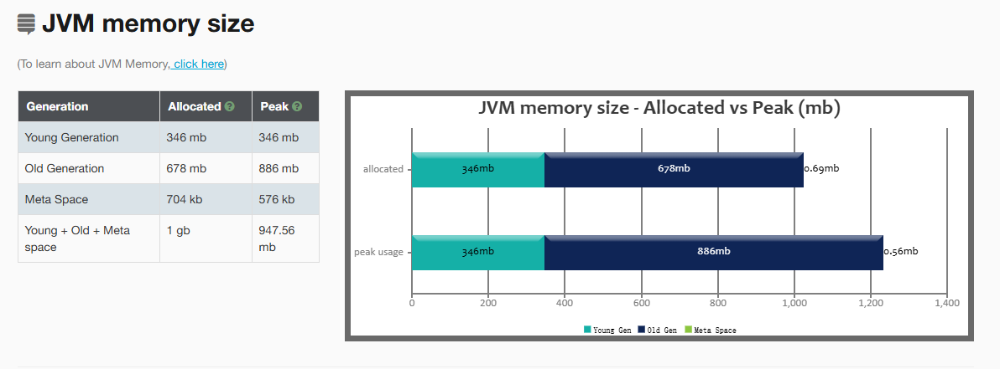

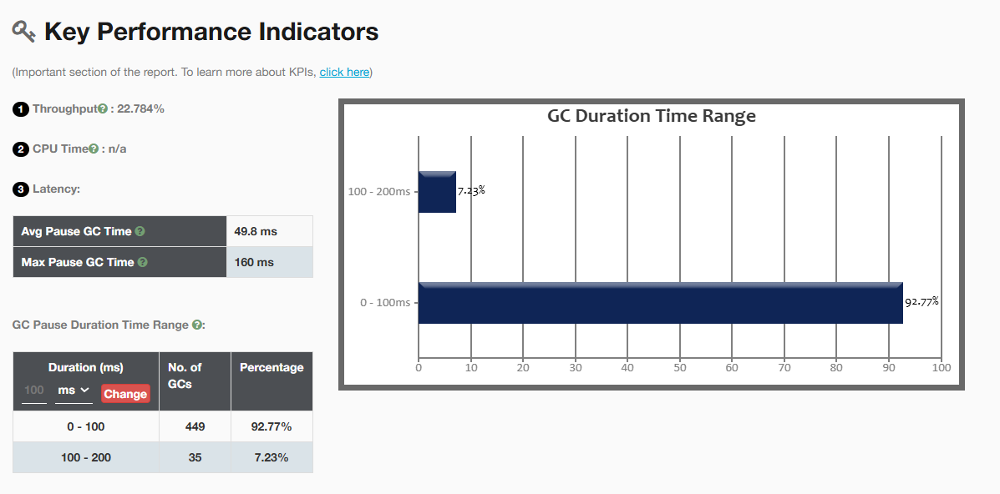

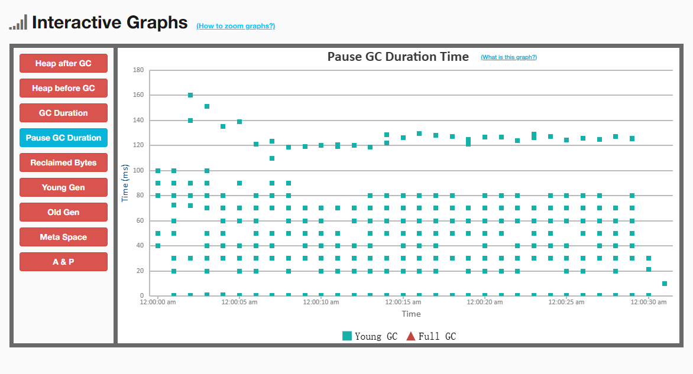

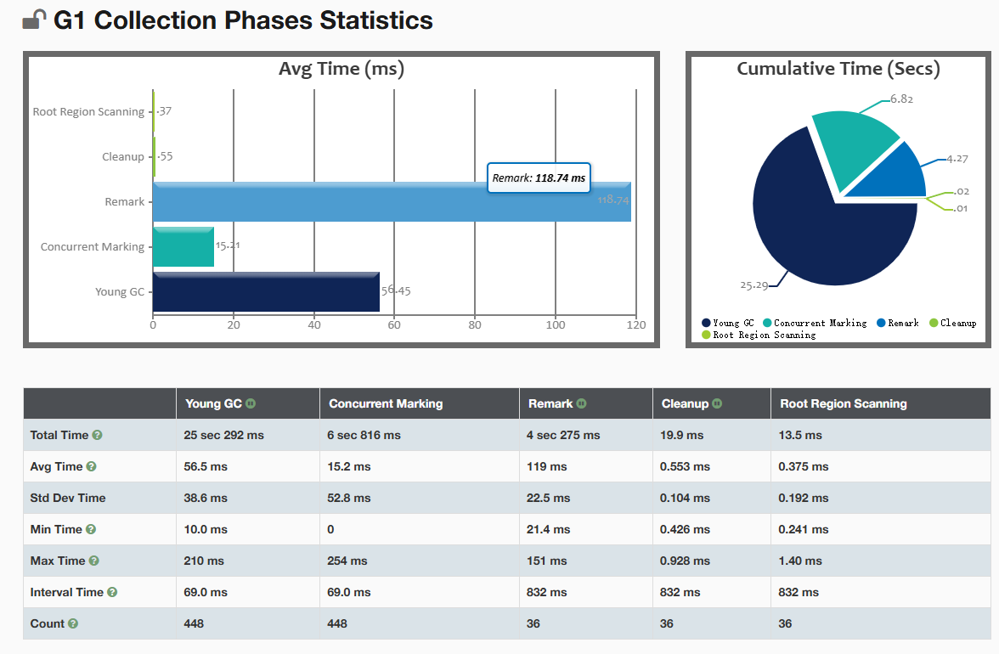

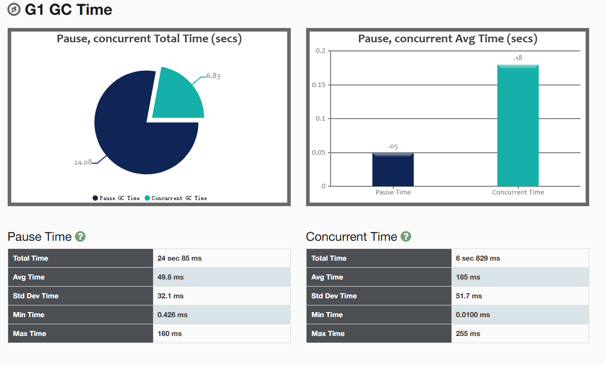


可以看到，不做任何修改的时候，程序运行30秒，发生了448次Young GC，这里的Young GC包括了单纯的Young GC和MixedGC等。停顿时间达到 24.84s。吞吐量也不是很高。

有趣的是，我在最开始的时候使用的是linux-x86_64-server-release的jdk做对照试验，发现实验结果有很大的不同，明显比linux-x86_64-server-fastdebug版本的jdk实验要好。

#### 3.2.2 不进行修改时，编译出的 linux-x86_64-server-release 版本的jdk的实验

在都运行30秒的情况下， linux-x86_64-server-release版本的jdk的表现如下:


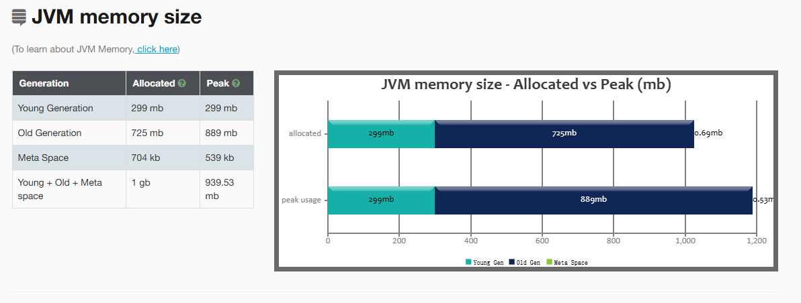

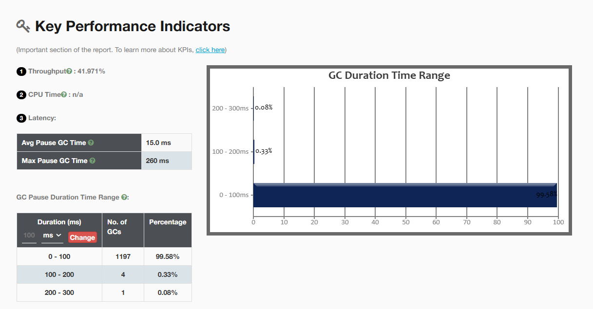

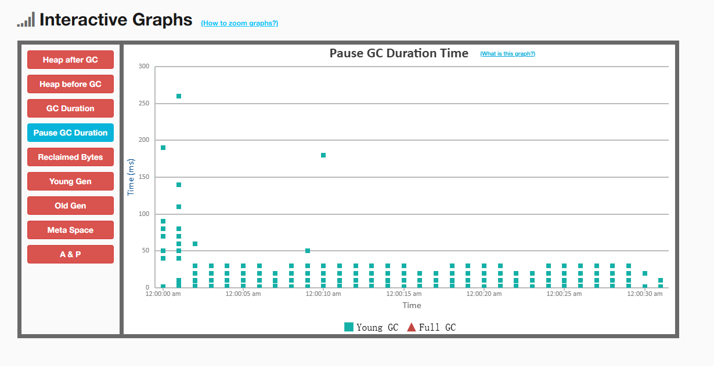

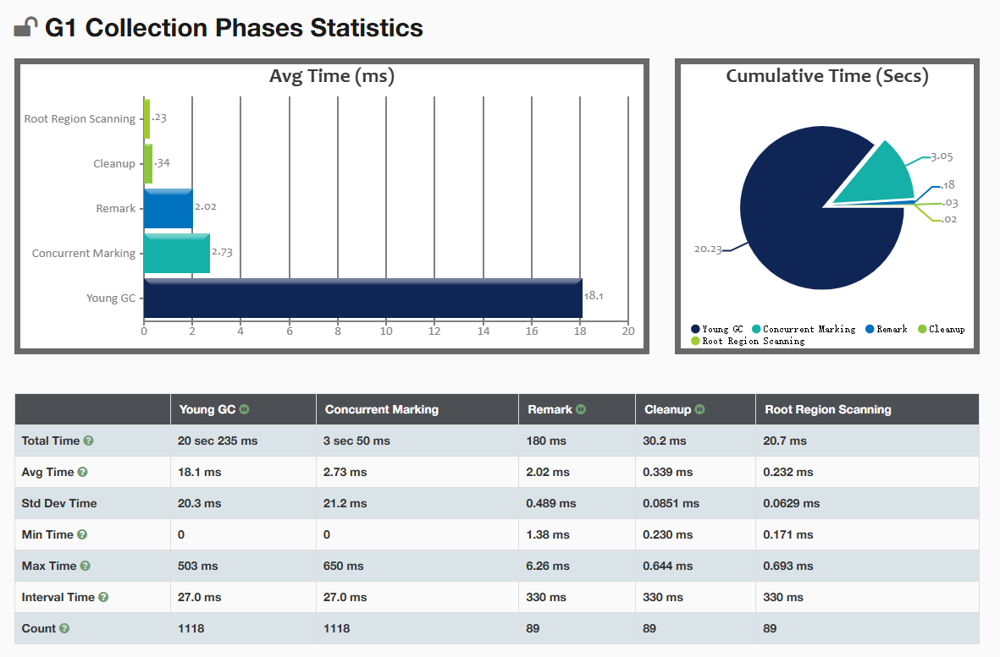

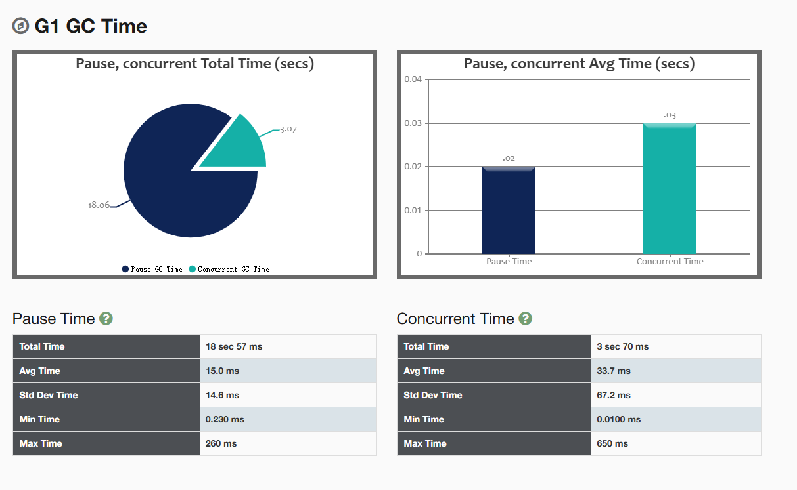

可以看到， linux-x86_64-server-release版本的jdk应该是做了优化，GC次数明显变多了，达到1118次，但是每次GC的停顿时间却很少，以GC次数换更少的停顿时间，这明显是合理的，减少GC的停顿时间，增大GC的吞吐量。


### 3.3 实验目标

在 linux-x86_64-server-fastdebug版本的jdk上进行优化，动态调整G1OldCSetRegionThresholdPercent，G1MixedGCCountTarget和G1MixedGCLiveThresholdPercent参数，努力实现更短的GC暂停时间。

### 3.4 实验过程

实验之前得想清楚一个问题，什么时候才能更新这些参数呢？已知这些参数是在Mixed GC阶段才会被使用，而且在使用的阶段不要去做修改，只能是在Mixed GC之前去做修改，在整个系列的Mixed GC中，这些值不应该被改变。

下面来捋一下gc启动的过程

```c++
gc开始的时候会调用下面的函数
// src/hotspot/share/gc/g1/g1CollectedHeap.cpp
void G1CollectedHeap::collect(GCCause::Cause cause) {
  try_collect(cause);
}

在try_collect函数会根据gc的不停来调用不同的收集函数，其中，对于Young GC而言，会执行西面的代码
bool G1CollectedHeap::try_collect(GCCause::Cause cause)
...
    uint VM_G1CollectForAllocation op(0, gc_count_before,cause,policy()->max_pause_time_ms());
    VMThread::execute(&op); 
...
}

// src/hotspot/share/runtime/vmThread.cpp
会执行下面的的函数
void VM_G1CollectForAllocation::doit() {
...
	 _gc_succeeded = g1h->do_collection_pause_at_safepoint(_target_pause_time_ms);
...
}

// src/hotspot/share/gc/g1/g1CollectedHeap.cpp
bool G1CollectedHeap::do_collection_pause_at_safepoint(double target_pause_time_ms){
...
	bool G1CollectedHeap::do_collection_pause_at_safepoint(double target_pause_time_ms)
...
}

在下面的函数，就可以看到G1GC的全过程，我们关注的是老区CSet的选择和回收
oid G1CollectedHeap::do_collection_pause_at_safepoint_helper(double target_pause_time_ms) {
...
	calculate_collection_set(evacuation_info, target_pause_time_ms);
...
}

void G1CollectedHeap::calculate_collection_set(G1EvacuationInfo& evacuation_info, double target_pause_time_ms) {
...
  _collection_set.finalize_initial_collection_set(target_pause_time_ms, &_survivor);
...
}

// src/hotspot/share/gc/g1/g1CollectionSet.cpp
void G1CollectionSet::finalize_initial_collection_set(double target_pause_time_ms, G1SurvivorRegions* survivor) {
  // 剩余时间，这里先计算young区Cset的时间
  double time_remaining_ms = finalize_young_part(target_pause_time_ms, survivor);
  // 计算old区CSet的时间,我们主要关注这个函数
  finalize_old_part(time_remaining_ms);
}

void G1CollectionSet::finalize_old_part(double time_remaining_ms) {
...
	_policy->calculate_old_collection_set_regions(candidates(), time_remaining_ms, num_initial_old_regions, num_optional_old_regions);
...
}


// src/hotspot/share/gc/g1/g1Policy.cpp,在这个函数里计算CSet的数量和处理时间，下面是完整的函数
void G1Policy::calculate_old_collection_set_regions(G1CollectionSetCandidates* candidates,
                                                    double time_remaining_ms,
                                                    uint& num_initial_regions,
                                                    uint& num_optional_regions)
{
void G1Policy::calculate_old_collection_set_regions(G1CollectionSetCandidates* candidates,
                                                    double time_remaining_ms,
                                                    uint& num_initial_regions,
                                                    uint& num_optional_regions) {
  assert(candidates != NULL, "Must be");

  num_initial_regions = 0;
  num_optional_regions = 0;
  // 记录在时间耗尽的情况下仍被加入的老年代区域数量。
  uint num_expensive_regions = 0;

  // 整个老年代区域的预测时间
  double predicted_old_time_ms = 0.0;
  // 预测的初始区域的时间
  double predicted_initial_time_ms = 0.0;
  // 预测的可选区域的时间
  double predicted_optional_time_ms = 0.0;

  double optional_threshold_ms = time_remaining_ms * optional_prediction_fraction();


    // 看这里，看这里，我在这里更新参数
  update_other_g1_params(candidates->num_regions());
	//看这里


  const uint min_old_cset_length = calc_min_old_cset_length(candidates);
  const uint max_old_cset_length = MAX2(min_old_cset_length, calc_max_old_cset_length());
  const uint max_optional_regions = max_old_cset_length - min_old_cset_length;
  bool check_time_remaining = use_adaptive_young_list_length();

  uint candidate_idx = candidates->cur_idx();

  log_debug(gc, ergo, cset)("Start adding old regions to collection set. Min %u regions, max %u regions, "
                            "time remaining %1.2fms, optional threshold %1.2fms",
                            min_old_cset_length, max_old_cset_length, time_remaining_ms, optional_threshold_ms);
  
  HeapRegion* hr = candidates->at(candidate_idx);
  while (hr != NULL) {
    // 检查当前加入的初始和可选区域数是否已经达到最大允许的老年代区域数。如果达到，输出日志并退出循环。
    if (num_initial_regions + num_optional_regions >= max_old_cset_length) {
      // Added maximum number of old regions to the CSet.
      log_debug(gc, ergo, cset)("Finish adding old regions to collection set (Maximum number of regions). "
                                "Initial %u regions, optional %u regions",
                                num_initial_regions, num_optional_regions);
      break;
    }

    // 预测当前区域的处理时间，并更新剩余的时间，确保不会为负数。
    double predicted_time_ms = predict_region_total_time_ms(hr, false);
    time_remaining_ms = MAX2(time_remaining_ms - predicted_time_ms, 0.0);

    // 如果初始区域数小于最小值，继续添加区域，并更新预测的总时间。若时间已耗尽，记录这个“昂贵”的区域。
    if (num_initial_regions < min_old_cset_length) {
      predicted_old_time_ms += predicted_time_ms;
      num_initial_regions++;
      // 记录没有时间剩余的regions的数量
      if (time_remaining_ms == 0.0) {
        num_expensive_regions++;
      }
    } else if (!check_time_remaining) {
       // 如果不需要检查剩余时间（非自适应调整模式），当达到最小区域数时，停止添加。
      log_debug(gc, ergo, cset)("Finish adding old regions to collection set (Region amount reached min).");
      break;
    } else {
    // 在自适应模式下，如果剩余时间足够，继续添加初始区域。如果剩余时间不足但大于 0，添加可选区域。否则，停止选择区域。

      if (time_remaining_ms > optional_threshold_ms) {
        predicted_old_time_ms += predicted_time_ms;
        num_initial_regions++;
      } else if (time_remaining_ms > 0) {
        // Keep adding optional regions until time is up.
        assert(num_optional_regions < max_optional_regions, "Should not be possible.");
        predicted_optional_time_ms += predicted_time_ms;
        num_optional_regions++;
      } else {
        log_debug(gc, ergo, cset)("Finish adding old regions to collection set (Predicted time too high).");
        break;
      }
    }
    // 获取下一个区域
    hr = candidates->at(++candidate_idx);
  }
}

}
```


#### 3.4.1 版本1

我尝试着找到参数G1MixedGCCountTarget，G1OldCSetRegionThresholdPercent和时间的关系，在最初的改动中，我通过预测gc的暂停时间来对参数进行改动，每次也是改变固定的值。在这一版中没有修改G1MixedGCLiveThresholdPercent的值

```
void G1Policy::update_other_g1_params() {
    double predict_pause_time = _analytics->predict_total_pause_time_ms();
    double last_avg_total_pause_time = last_avg_total_pause_time_ms();
    record_last_avg_total_pause_time_ms(predict_pause_time);
    double eps = 0.000001;
    if (last_avg_total_pause_time < eps) {
        continue;
    }
    if (predict_pause_time < last_avg_total_pause_time) {
        G1MixedGCCountTarget = MAX2(G1MixedGCCountTarget - 1, (uintx)5);
        G1OldCSetRegionThresholdPercent = MIN2( G1OldCSetRegionThresholdPercent + 3, (uintx)25);
    } else {
        G1MixedGCCountTarget = MIN2(G1MixedGCCountTarget + 1, (uintx)12);
        G1OldCSetRegionThresholdPercent = MAX2( G1OldCSetRegionThresholdPercent - 3,(uintx)5);
    }
}

其中：_analytics->predict_total_pause_time_ms();函数如下：
// src/hotspot/share/gc/g1/g1Analytics.cpp
double G1Analytics::predict_total_pause_time_ms() const {
  return predict_zero_bounded(_total_pause_time_ms_seq);
}
其中的停顿值在函数report_total_pause_time_ms中记录
void G1Analytics::report_total_pause_time_ms(double total_pause_time_ms) {
    _total_pause_time_ms_seq->add(total_pause_time_ms);
}

report_total_pause_time_ms在record_collection_pause_end中调用
// src/hotspot/share/gc/g1/g1Policy.cpp
void G1Policy::record_collection_pause_end(double pause_time_ms, bool concurrent_operation_is_full_mark) {
...
_analytics->report_constant_other_time_ms(constant_other_time_ms(pause_time_ms));
// 这里调用
    _analytics->report_total_pause_time_ms(pause_time_ms);
...
}
```

**结果分析**

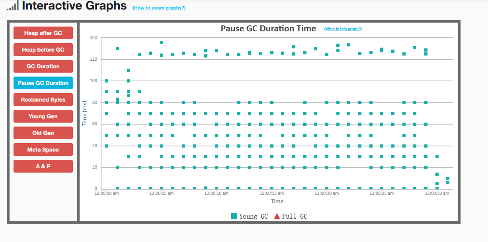

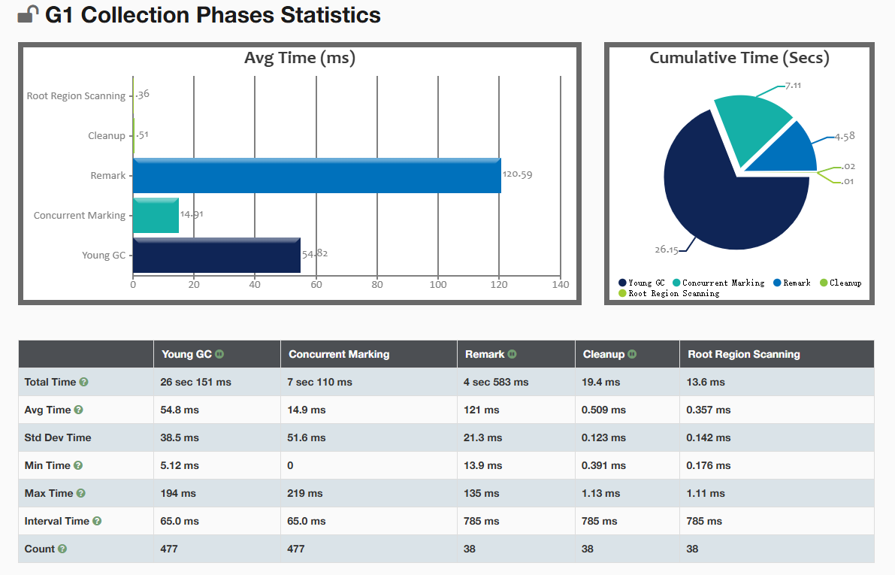

可以看到，跟原始版本的linux-x86_64-server-fastdebug并无多大区别。

目前存在问题，参数每次增加或减少的量都是固定的，而且也不能预测G1MixedGCLiveThresholdPercent的参数。

#### 3.4.2 版本2

对于每次Mixed GC来说，我们关心的其实是回收多少个Regions，这三个参数都是在为它服务的，可以根据每次Mixed GC中候选CSet的数量的增加或减少，来确定参数的增加或减少。

```
void G1Policy::update_other_g1_params(size_t candidates_region_num) {

    // 获取堆的全部region数量
    const G1CollectedHeap* g1h = G1CollectedHeap::heap();
    const size_t all_region_num = g1h->num_regions();

    // 这里是加入到候选集合的比例
    TruncatedSeq* candidates_seq = candidates_cset_seq();
    // 历史平均
    double history_avg_candidates =  candidates_seq->avg();
    record_or_add_candidates_cset_num(candidates_region_num);

    TruncatedSeq* region_seq = region_cset_seq();
    double history_avg_region_num = region_seq->avg();
    record_or_add_region_cset_num(all_region_num);

    double rate = 0.0;

    // 更新G1MixedGCCountTarget和G1OldCSetRegionThresholdPercent
    int diff_candidates = candidates_region_num - history_avg_candidates;
    if (diff_candidates < 0) {
        rate = ((-1.0) * diff_candidates) / (history_avg_candidates);
        uintx add = (uintx) rate * G1MixedGCCountTarget;
        G1MixedGCCountTarget = MIN2( G1MixedGCCountTarget + add,(uintx)12);

    } else {
        rate = (1.0 * diff_candidates) / history_avg_candidates;
        uintx reduce = (uintx) rate * G1MixedGCCountTarget;
        G1MixedGCCountTarget = MAX2( G1MixedGCCountTarget - reduce,(uintx)4);
    }

    int diff_region = all_region_num - history_avg_region_num;
    if (diff_region < 0) {
        rate = ((-1.0) * diff_region) / (history_avg_region_num);
        uintx reduce = (uintx) rate * G1OldCSetRegionThresholdPercent;
        G1OldCSetRegionThresholdPercent = MAX2( G1OldCSetRegionThresholdPercent - reduce,(uintx)5);
    } else {
        rate = (1.0 * diff_region) / history_avg_region_num;
        uintx add = (uintx) rate * G1OldCSetRegionThresholdPercent;
        G1OldCSetRegionThresholdPercent = MIN2( G1OldCSetRegionThresholdPercent + add,(uintx)25);
    }
}
```

对于G1MixedGCLiveThresholdPercent，需要在筛选候选Regions的时候就进行调整，所以在g1CollectionSetCandidates类中进行更新，找到当前region存活数据的平均值是一个比较好的选择，在平均值的基础上进行平滑更新，作为当前的G1MixedGCLiveThresholdPercent参数。

```
// src/hotspot/share/gc/g1/g1CollectionSetCandidates.cpp
void G1CollectionSetCandidates::verify() const {
  uint idx = _front_idx;
  uint curIndex = _front_idx;
  size_t sum_of_reclaimable_bytes = 0;
  HeapRegion *prev = NULL;
  size_t liveByte = 0;
  size_t reg_size = HeapRegion::GrainBytes;
  size_t regionTotalSize = (_num_regions - curIndex) * reg_size;

  for (; curIndex < _num_regions; curIndex++) {
    HeapRegion *cur = _regions[curIndex];
    liveByte += cur->live_bytes();
  }
  uint avg_live = ((liveByte * 100) / regionTotalSize);
  G1MixedGCLiveThresholdPercent = MAX2(MIN2((uintx)(avg_live * 7 + G1MixedGCLiveThresholdPercent * 3) / 10, (uintx)95), (uintx)50);

}
```

**结果分析**

由于测试程序具有随机性，随机生成不同大小的对象，所以每次实验结果都不太一样，下面是比较好的和比较差的结果

比较好的：

虽然这个结果中停顿时间少了2~3秒，但是GC前期有很长的震荡期

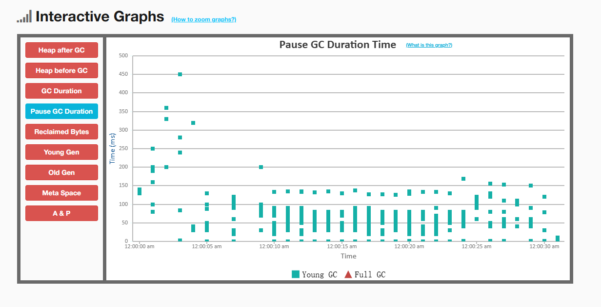

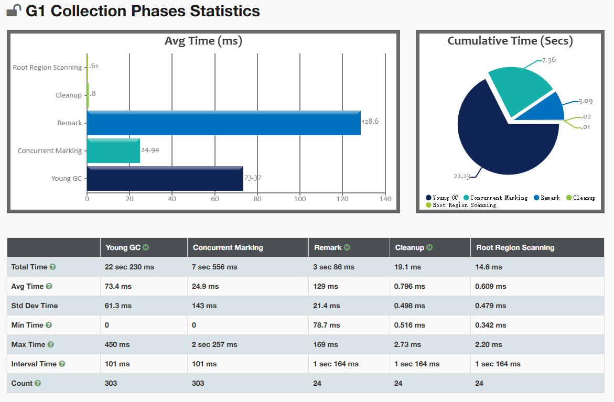


比较差的：

GC时间比较长，但是很有规律，没有出现前期震荡。

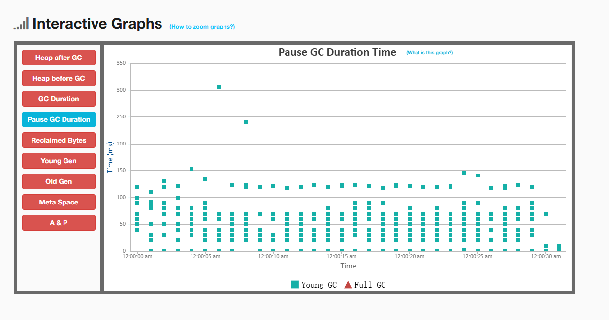

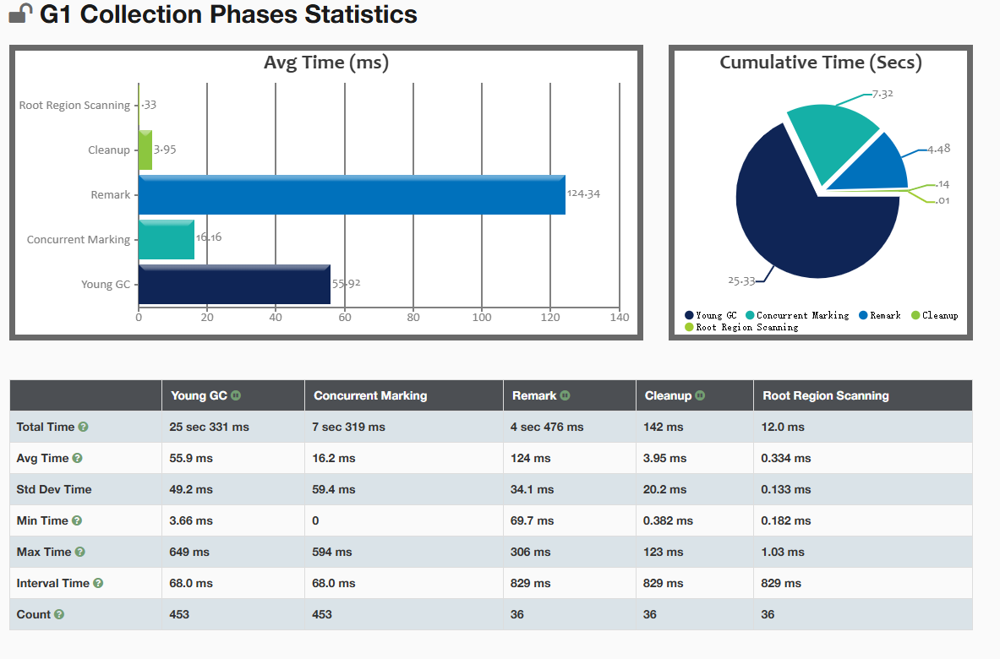


#### 3.4.3 版本3

这一版本会加入停顿时间，根据当前GC的预测停顿时间和历史停顿时间，做出相应的选择。

```
void G1Policy::update_other_g1_params(size_t candidates_region_num) {
	double predict_pause_time = _analytics->predict_total_pause_time_ms();
    double last_avg_total_pause_time = last_avg_total_pause_time_ms();
    record_last_avg_total_pause_time_ms(predict_pause_time);
    double eps = 0.000001;
    if (last_avg_total_pause_time < eps) {
        return;
    }
    const G1CollectedHeap* g1h = G1CollectedHeap::heap();
    const size_t all_region_num = g1h->num_regions();

    TruncatedSeq* candidates_seq = candidates_cset_seq();
    double history_avg_candidates = candidates_seq->avg();
    record_or_add_candidates_cset_num(candidates_region_num);

    TruncatedSeq* region_seq = region_cset_seq();
    double history_avg_region_num = region_seq->avg();
    record_or_add_region_cset_num(all_region_num);

    if (_g1h->gc_cause() != GCCause::_g1_periodic_collection) {
        // 使用停顿时间预测和历史数据动态调整增减比例
        double pause_factor = predict_pause_time / last_avg_total_pause_time; // 根据停顿时间调整比例
        pause_factor = MIN2(MAX2(pause_factor, 0.5), 2.0);
        double smoothing_factor = 3;
        // 更新G1MixedGCCountTarget
        int diff_candidates = candidates_region_num - history_avg_candidates;
        if (diff_candidates < 0) {
            double rate = (-1.0 * diff_candidates) / (history_avg_candidates);
            uintx add = (uintx)(rate  * pause_factor * G1MixedGCCountTarget);
            G1MixedGCCountTarget = MIN2((uintx)(G1MixedGCCountTarget * (10 - smoothing_factor) +  (G1MixedGCCountTarget + add) * smoothing_factor) / 10, (uintx)12);
        } else {
            double rate = (1.0 * diff_candidates) / (history_avg_candidates);
            uintx reduce = (uintx)(rate  * pause_factor * G1MixedGCCountTarget);
            G1MixedGCCountTarget = MAX2((uintx)(G1MixedGCCountTarget * (10 - smoothing_factor) +  (G1MixedGCCountTarget - reduce) * smoothing_factor) / 10, (uintx)6);
        }

        int diff_region = all_region_num - history_avg_region_num;
        if (diff_region < 0) {
            double rate = (-1.0 * diff_region) / (history_avg_region_num);
            uintx reduce = (uintx)(rate  * pause_factor * G1OldCSetRegionThresholdPercent);
            G1OldCSetRegionThresholdPercent = MAX2((uintx)(G1OldCSetRegionThresholdPercent * (10 - smoothing_factor) +  (G1OldCSetRegionThresholdPercent - reduce) * smoothing_factor) / 10 , (uintx)6);
        } else {
            double rate = (1.0 * diff_region) / (history_avg_region_num);
            uintx add = (uintx)(rate  * pause_factor * G1OldCSetRegionThresholdPercent);
            G1OldCSetRegionThresholdPercent = MIN2((uintx)(G1OldCSetRegionThresholdPercent * (10 - smoothing_factor) +  (G1OldCSetRegionThresholdPercent + add) * smoothing_factor) / 10 , (uintx)18);
        }
    }
}
```

利用预测的停顿时间和历史停顿时间做影响因子，理由如下：

如果当前GC预测的停顿时间大于历史停顿时间，说明当前有更多的垃圾收集，那么就应该收集更多的CSet，也就是G1MixedGCCountTarget减少的幅度会大一些，G1OldCSetRegionThresholdPercent增加的幅度大一些，每次GC收集的Region数量也多一点。


**结果分析**

好点的结果：

由下面的图表可以看到，在这种策略下，在前期中，GC可能会出现较大的波动，但时间久了，会趋于平稳，而且GC的时间也比较短。GC次数也得到大幅度的减少。

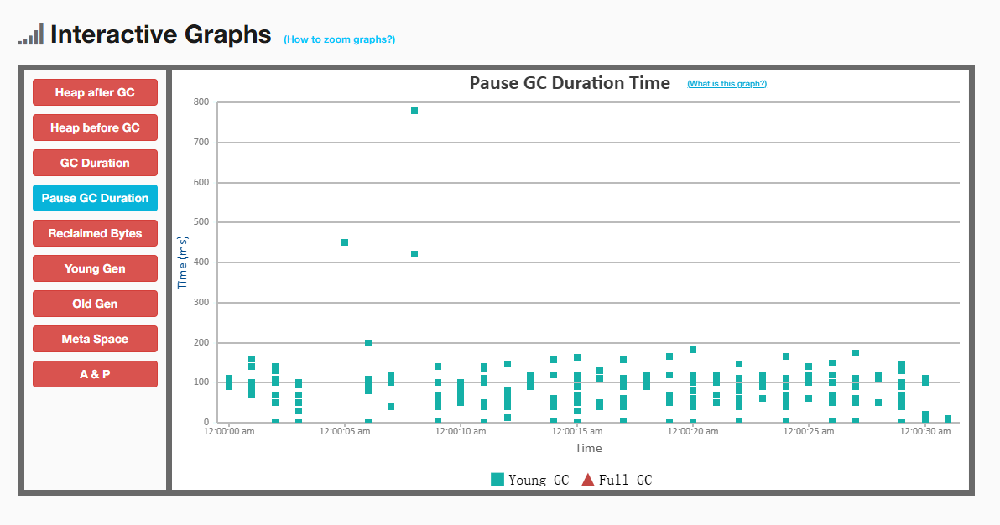

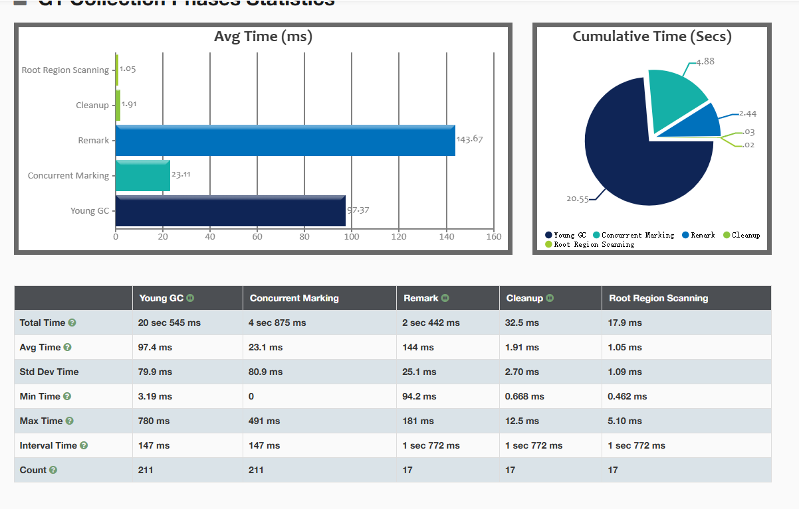


较差的结果：

这个结果比较稳定，基本跟linux-x86_64-server-fastdebug相同

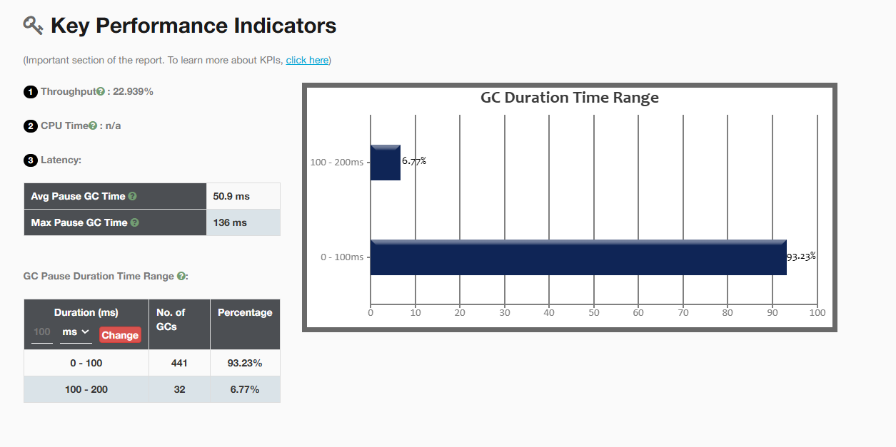

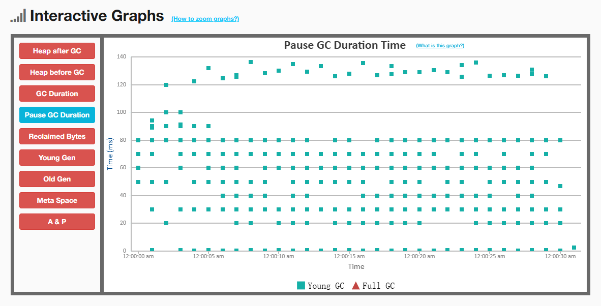

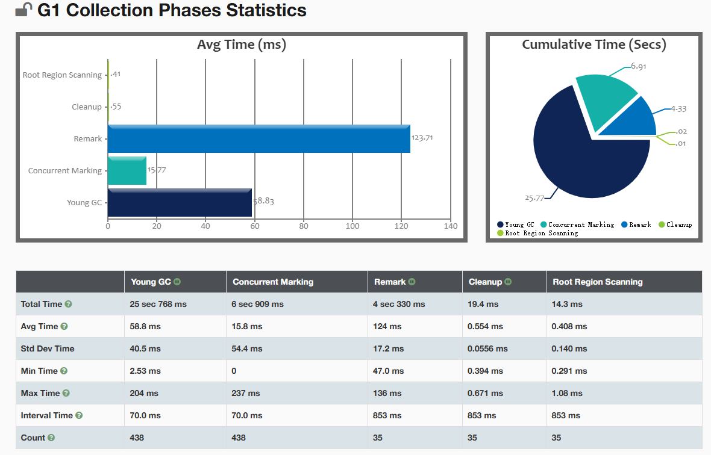